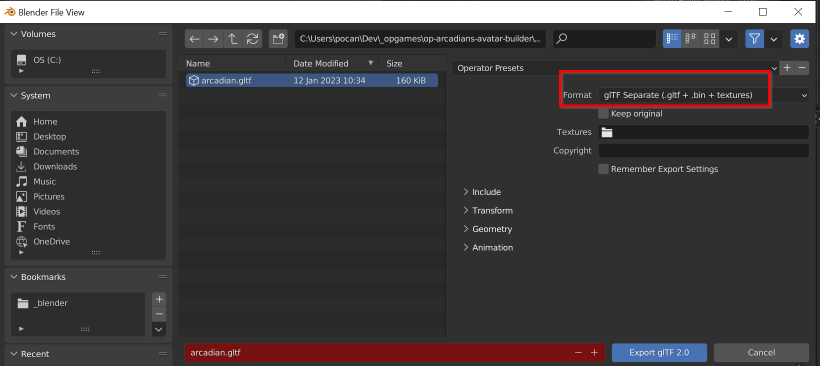

# arcadians-avatar-builder 🧙

## What's this?

This project will be embedded to the Arcadians v2 mint site. It shows an animated Arcadian and can play different animations and wear different parts

## Features:

-   This takes in a GLTF file that contains the mesh of an animated Arcadian.
-   The parts of the Arcadian can be mixed and matched
-   Predefined animations can be exported to a PNG sprite sheet
-   Front end HTML code can call the functions in the JS code to change parts and animations

## Getting started

-   Clone the repository
-   Run any http server on the working directory (i.e. `http-server`)
-   Open http://localhost:8080

## Config file

-   [`config.js`](v1/config.js) has been provided as a starting point that contains the v1 Arcadians data
-   It contains settings on the following:
    -   exporting the sprite sheet
    -   list of gltf files, materials and animations
    -   list of parts
-   The config file contains documentation comments on the important sections

## Adding new pngs to existing parts

New pngs can be added in the selection by copying the pngs to their appropriate folder in ['v1/arcadian-parts'](v1/arcadian-parts).

Directories here as structured as:

`arcadian-parts/[Gender]/[Part]/[FileName].png`

Take care to keep the directory structure as is.

Once all the desired pngs have been added, run ['updatePartsConfig.js'](src/updatePartsConfig.js) via node in the terminal. E.g. if you have the terminal open in the root directory, the command would be:

To run for V1 - `node src/updatePartsConfig.js`  
To run for V2 - `node src/updatePartsConfig.js v2`

If no errors pop up, then the config has been updated and the new parts can be viewed in the html on refresh.

## Adding new body parts

For each body part, you will have to do the following steps:

1. Add the body part pngs
	1. Create a new directory for the new part, like so: `v2/arcadian-parts/<Gender>/<Body Part Name>/`
	1. Place the PNGs there
	1. Run parts config script. `node src/updatePartsConfig.js v2`
1. Update the Blender file by adding new polygons that would be used for that new part
	1. [Duplicate an existing material](docs/dup-material.md)
	1. Assign faces that would use this new material
	1. Export to GLTF  
	
1. Update [v2/config.js](v2/config.js) to add the new material name
1. After these steps, the new body part should be usable

## Adding a new gender

1. Duplicate the Male folders inside `arcadian-parts` and `gltf` folders
1. Update the config.js file by copying the male block and pasting it at the bottom. Remember to check the syntax of the json.
1. See if it shows up in the html page
1. Add/replace the images for the body parts

## Avatar Canvas Game Lego

-   [`avatarCanvas.js`](src/avatarCanvas.js) is a reusable game lego for drawing and playing animations from the exported sprite sheet
-   [Demo page](test-avatar-canvas.html) has been provided as a sample how to use this class

## References

* https://github.com/polats/game-lego-nft-avatars
* https://gitlab.com/inklabapp/jsora