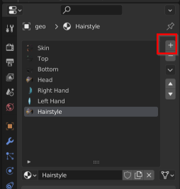
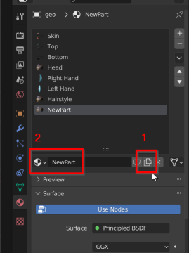
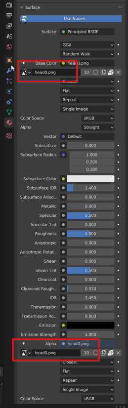

# Duplicating a material in Blender

1. Click the + button in the material panel.  

3. Click the dropdown and pick an existing material  

5. Click the icon to make a copy. Then assign a name  

7. Change the images  
